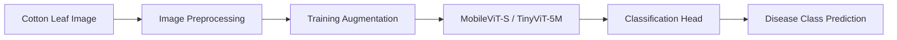

<div align="center">

🌿 MobileTinyViT

Lightweight Cotton Leaf Disease Classification with MobileViT and TinyViT

<p>
  <strong>
    A research framework for cotton leaf disease classification using lightweight Vision Transformers,
    image enhancement, training-only augmentation, stratified cross-validation, and efficient transfer learning.
  </strong>
</p>

<p>
  
  
  
  
  
  
</p>

<p>
  <b>Lightweight Transformers</b> •
  <b>Image Enhancement</b> •
  <b>Data Augmentation</b> •
  <b>Cross-Validation</b>
</p>

</div>

## Contributors

* Ashikuzzaman

## 🌟 Overview

**MobileTinyViT** is a lightweight deep-learning framework for cotton leaf and plant disease classification from images.

The project evaluates compact Vision Transformer architectures with a complete image-classification workflow:

- Dataset preparation from the Kaggle Cotton 4-Class dataset.
- Image resizing, contrast enhancement, denoising, and normalization.
- Training-only image augmentation.
- Transfer learning using MobileViT-S and TinyViT-5M.
- Stratified 5-fold cross-validation.
- Early stopping and adaptive learning-rate scheduling.
- Evaluation using accuracy, Cohen’s Kappa, ROC-AUC, and PR-AUC.

The main objective is to develop an efficient classification pipeline that can be used as a foundation for future mobile, edge-AI, and smart-agriculture applications.

## ✨ Highlights

<table>
<tr>
<td width="50%">

🌿 Model Design

ImageNet-pretrained MobileViT-S

ImageNet-pretrained TinyViT-5M

224 × 224 input resolution

Transfer learning

Cross-entropy classification head

GPU acceleration with CUDA

</td>
<td width="50%">

🔬 Evaluation

Stratified 5-fold cross-validation

Training and validation monitoring

Early stopping

ReduceLROnPlateau scheduler

Accuracy and Cohen’s Kappa

ROC-AUC and PR-AUC

</td>
</tr>
</table>

## 🧠 Model Pipeline



## 🧩 Model Components

| Component | Configuration |
|---|---|
| Backbone 1 | ImageNet-pretrained MobileViT-S |
| Backbone 2 | ImageNet-pretrained TinyViT-5M (`tiny_vit_5m_224`) |
| Input | `3 × 224 × 224` |
| Classification | Task-specific linear classification head |
| Loss | Cross-Entropy Loss |
| Optimizer | Adam |
| Scheduler | ReduceLROnPlateau |
| Early stopping | Patience of 5 validation checks |
| Device | CUDA GPU when available, otherwise CPU |

## 🖼️ Image Preprocessing

The input images are processed before training using the following pipeline:


| Processing step | Configuration |
|---|---|
| Resize | `224 × 224` |
| Color processing | YUV color space |
| Contrast enhancement | Histogram equalization on the Y channel |
| Noise reduction | Gaussian blur with a `3 × 3` kernel |
| Pixel scaling | Values normalized to `[0, 1]` |
| Model normalization | ImageNet mean and standard deviation |

## 🔄 Data Augmentation

Augmentation is applied only to the training data. Original training images are preserved, and additional transformed samples are generated using randomly selected operations.

| Augmentation | Configuration |
|---|---|
| Flip | Random horizontal, vertical, or combined flip |
| Rotation | Random angle between `−25°` and `+25°` |
| Zoom | Random zoom between `0.8×` and `1.2×` |
| Brightness | Random factor between `0.7` and `1.3` |

## 📚 Dataset

This project uses the following publicly available Kaggle dataset:

| Property | Details |
|---|---|
| Dataset | [Cotton 4-Class](https://www.kaggle.com/datasets/sohansakib75/cotton-4-class) |
| Dataset owner | `sohansakib75` |
| Task | Cotton leaf disease classification |
| Number of classes | 4 |
| Dataset format | Image folders organized by class |
| Download method | Kaggle API / Kaggle CLI |

The notebook expects the extracted dataset to follow a structure similar to:

```text
cotton-4-class/
└── Cotton leaf/
    ├── class_1/
    ├── class_2/
    ├── class_3/
    └── class_4/
```

The exact class names are loaded automatically from the dataset directories using `ImageFolder`.

> The dataset is not included in this repository. Please follow the dataset owner’s terms and conditions on Kaggle.

## ⚙️ Dataset Split

The notebook creates the following dataset split:

| Split | Ratio |
|---|---:|
| Training | 80% |
| Validation | 10% |
| Testing | 10% |

The training data is augmented, while validation and test data remain unaugmented for a more reliable evaluation.

## 🧪 Training Configuration

| Setting | Value |
|---|---:|
| Input resolution | `224 × 224` |
| Batch size | `32` |
| Maximum epochs | `30` |
| Optimizer | Adam |
| Learning rate | `1e-4` |
| Weight decay | `1e-4` |
| Loss | Cross-Entropy Loss |
| Scheduler | ReduceLROnPlateau |
| Scheduler patience | `1` |
| Early stopping patience | `5` |
| Cross-validation | Stratified 5-Fold |
| Seed | `42` |
| Normalization | ImageNet mean/std |
| AMP | Not enabled in the current notebook |

## 📊 Evaluation Metrics

The experiments calculate the following metrics:

| Metric | Purpose |
|---|---|
| Accuracy | Overall classification correctness |
| Cohen’s Kappa | Agreement between predictions and labels beyond chance |
| ROC-AUC | Class-discrimination performance |
| PR-AUC | Precision-recall performance across classes |

The notebook reports per-fold scores and a final five-fold summary using the mean and standard deviation of the evaluation metrics.

## 🆚 Compared Models

The repository contains experiments with two lightweight transformer architectures:

| Model | Description |
|---|---|
| MobileViT-S | Lightweight hybrid convolution-transformer model |
| TinyViT-5M | Compact Vision Transformer for efficient image recognition |

These models are suitable for investigating the trade-off between classification performance and computational efficiency.

## 📁 Repository Structure

```text
MobileTinyVit/
│
├── cotton.ipynb
│   ├── Kaggle dataset download
│   ├── Dataset extraction and inspection
│   ├── Image preprocessing
│   ├── Train / validation / test split
│   ├── Training-only augmentation
│   ├── MobileViT-S training
│   ├── TinyViT-5M training
│   ├── Stratified five-fold cross-validation
│   └── Metric calculation
│
├── cotton.pdf
│   └── Project document / report
│
└── README.md
```

## 🚀 Quick Start

### 1. Clone the repository

```bash
git clone https://github.com/Ashikuzzaman026/MobileTinyVit.git
cd MobileTinyVit
```

### 2. Create an environment

```bash
python -m venv .venv
```

Linux/macOS:

```bash
source .venv/bin/activate
```

Windows:

```bash
.venv\Scripts\activate
```

### 3. Install dependencies

```bash
pip install torch torchvision timm opencv-python \
 numpy scikit-learn matplotlib kaggle jupyter
```

### 4. Configure Kaggle API

Place your Kaggle API token at:

```text
~/.kaggle/kaggle.json
```

Then run:

```bash
chmod 600 ~/.kaggle/kaggle.json
```

On Windows, configure the Kaggle API according to your operating system’s Kaggle CLI setup.

> Do not upload `kaggle.json` or any private API credentials to GitHub.

### 5. Open the notebook

```bash
jupyter notebook cotton.ipynb
```

A GPU runtime is recommended for model training.

## ▶️ Recommended Execution Flow

```text
Dataset Download
      ↓
Dataset Extraction and Inspection
      ↓
Image Preprocessing
      ↓
Train / Validation / Test Split
      ↓
Training-Only Augmentation
      ↓
MobileViT-S Training
      ↓
TinyViT-5M Training
      ↓
Stratified 5-Fold Cross-Validation
      ↓
Metric Calculation
      ↓
Model Comparison
```

## 📦 Requirements

Core stack:

- Python 3.x
- PyTorch
- TorchVision
- `timm`
- OpenCV
- NumPy
- Scikit-learn
- Matplotlib
- Kaggle API
- Jupyter Notebook or Google Colab

## ⚠️ Limitations

- The current repository contains the research notebook and report, not a production-ready mobile application.
- Model performance may vary depending on the dataset version, random seed, hardware, and software versions.
- Real-world field images may contain lighting, background, camera, and viewpoint differences that are not represented in the training data.
- The model should be validated on independent field data before practical deployment.
- Predictions are intended for research and decision-support purposes and should not replace expert agricultural diagnosis.

## 🔭 Future Extensions

Possible future extensions include:

- Single-image inference script
- Mobile or web demonstration interface
- ONNX, TorchScript, or TensorFlow Lite export
- Edge-device latency and memory benchmarking
- Explainability with Grad-CAM or attention visualization
- External field-image validation
- Model quantization and pruning

## 📌 Citation

If this repository contributes to your research, please cite the associated project work and repository:

```bibtex
@misc{mobiletinyvit,
  title        = {MobileTinyViT: Rapid and Interpretable Detection of Cotton Leaf and Plant Diseases Using Lightweight Vision Transformers},
  author       = {Ashikuzzaman},
  year         = {2026},
  publisher    = {GitHub},
  url          = {https://github.com/Ashikuzzaman026/MobileTinyVit}
}
```

## 🤝 Contributions

Issues, suggestions, and pull requests related to the following areas are welcome:

- Cotton leaf disease classification
- Lightweight Vision Transformers
- Agricultural image analysis
- Data augmentation
- Model efficiency and edge deployment
- Reproducible deep-learning experiments

## 📄 License

No license has currently been specified for this repository. Until a license is added, please contact the repository owner before redistributing the code or using it for commercial purposes.

## Disclaimer

This repository is intended for academic and research purposes. The trained models have not been clinically or commercially validated and should not be treated as a substitute for professional agricultural assessment.

<div align="center">

🌿 Lightweight AI for Cotton Disease Detection

</div>
